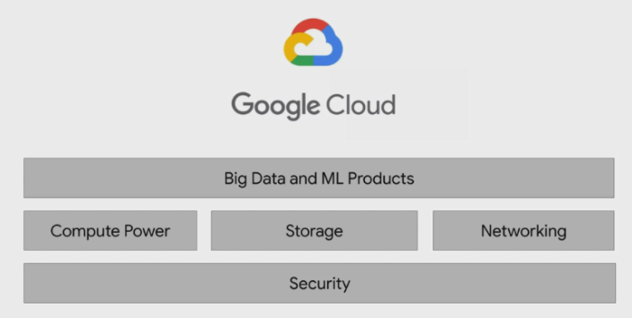
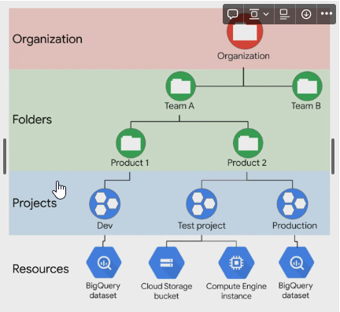
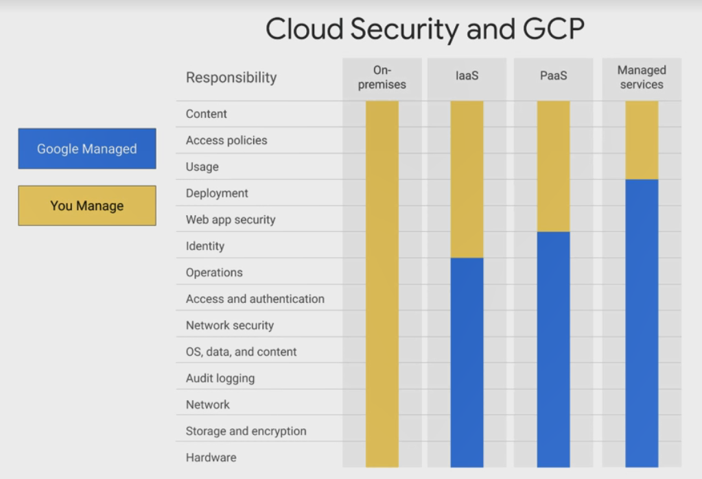

- ### Big data challenges
	- Migrating existing data workloads like Hadoop and spark
	- Analyzing large scale datasets at scale
	- Build streaming pipelines
	- Apply ML to data
### Architecture Big data and ML Architecture
	- 
	- The organization needs compute power to process a lot of data and it needs to scale for future without a lot of work hence compute power is crucial for organizations growth in the future
	- Google Provides their ML with fully trained models for others to use
	- Google Uses TPUs which is a specialized ML processors that are specifically created for ML applications. Google has made it available to others thro GCP
	- Demo Creating VM: we created a micro VM with a small processing power and 10gb of storage to just run some scripts
	- 1.  created a bare bone VM with debian
	  2.  installed GIT to pull source code from github
	  3.  downloaded earthquake date from the public sites
	  4.  processed it with the script provided to create an image
	  5.  copied the required files from the VM to the Google Cloud Storage
	  6.  Deleted the VM
	  7.  Gave public access to the file that we just uploaded.
	- GCPKeyLearnings: we can keep compute and storage independent
### Elastic Storage with Google Cloud Storage

Google had 4 kinds of storage classes based on the use case for the files

1.  **Standard storage**- frequently accessed data
2.  **Nearline Storage**: Low-cost storage that will be accessed once per month or less
3.  **Cold line Storage**: very low-cost that will be accessed once per quarter or less
4.  **Archive storage**: Ultra low cost storage that will be accessed only for archiving or DR.

Use standard storage to stage files within the same region

**Project** is a base level organising entity for creating and using resources and services for managing billing API and Permissions

Zone and regions physically organize GCP Resources

Projects logically organize GCP Resources

Folders is a logical grouping for collections of projects

Organization is the root node for the entire GCP Hirerachy (Optional) but can be used to apply organization level policies to all the folders projects and resources under it
	- 
	- For all the VMs that were spinned up on GCP the GSUTIL will will already be present. For it to work on your local machine you will have to install the Google cloud SDK on you laptop to access it. commands like gsutil
	- Google Cloud 1PB/Sec of total bisection network
- **Security**
	- 
-
- Evolution of Google cloud big data tools
	- 2002 GFS - google file storage to handle huge files to be handled
	- 2004 - Map reduce to index
	- 2006 - big table streaming data handeling
	- 2008 - new tools like dremel (breaks into shards and stores as columnar data and then stores to retrive only what is required) this is a automanaged service
	- collossus flume megastore spanner pubsub
	- google has opened up these tools for everyone to use
- [[GCP Compute]]
- [[GCP Storage]]
-