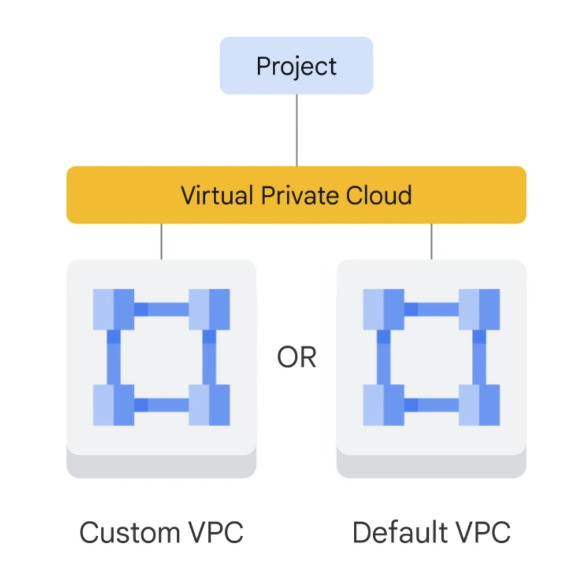

- VPC is a secure Individual Private Cloud within a Public code
- Customer can do what they want to do like hosting websites store data
- VPC combine Scalability of Public code and isolation of Private could
- Segment Networks
- Create Firewakks
- Create static routes
- VPC is Global and they can have Subnets in any Cloud region Meaning the same VPC can exist on multiple zones and regions
- helps with DR resilience and simple network
-
- VMs
	- Create and run without no Upfront cost
	- 1000s of CPUs can be configured on a system based on need
	- Full fleged OS
	- Is like a Physical server
	- Create using Console CLI API
	- Linux and windows or an custom Versions
	- Custom OS is also Possible
	- Cloud Market place Provides 3rd party software
		- No charge mostly
		- Commercial licence is charged for a few computes
	- BIll by second 1 Min Min
	- Sustained Discounts for 25% of a month
	- Committed use discount also available 1 year commitment 57 percent discount
	- Preemptibile VM or Spot VM
		- Job can be stopped and restarted
		- Pre - 24 hours Spot no time limit
	- Choose CPUs and Memory you need
- Scaling and VMs
	- VMs can added or removed based on Metrics
	- VPCs supports many types of Load balencing
-
	- VPC has routing tables It can be used to movetraffic from One to another without External IP address
	- VPC provides Firewall for incoming and outgoing Traffic
	- Firewall can be written to give traffic to a set of VMs with a certain Tags
- Cloud Balancing is to distribute Load between Instances
	- HTTP/S Global HTTPs
	- TCP Global SSL
	- SSLGlobal SSL
	- UDP
	- Regional
	- regional Internal
	- Cross regional Load balancing also available
- Google DNS: Host name to Addresses
	- Most advanced
	- Cloud DNS similar to Google DNS
	- server in many locations
	- Edge Cache is also available to Deliver Content
- How to connect - VPN
	- IPsecVPN Protocol to create a tunnel Not always the best Option
	- Direct Peering - Use a rounter to exchange traffic
	- Career Peering - gives direct access from on Premises Network
	- Dedicated Interconnect: MOst reliable Private connection
	- Partner Interconnect: Data centre is in a shared space where a partner can be provided
- 
-